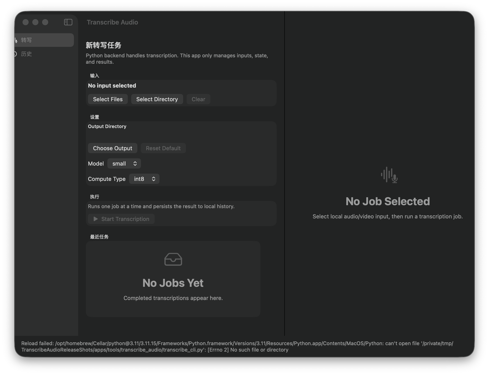

# TranscribeAudio

`TranscribeAudio` is a macOS-first local transcription toolkit. It combines a native SwiftUI desktop app, a Python CLI, and a local MCP server for agent-driven workflows.

## What It Does

- Transcribes local audio or video files on your machine.
- Stores plain-text transcripts, segment-level JSON, and run metadata.
- Exposes the same transcription flow through a desktop UI, a CLI, and MCP tools.
- Keeps outputs local by default instead of sending media through a hosted web product.

## Why This Project Exists

The goal is to make local transcription practical for day-to-day workflows:

- a native macOS app for manual jobs
- a scriptable JSON CLI for automation
- an MCP server for local agent integrations

## Features

- Native macOS app built with SwiftUI
- Python CLI with stable JSON output
- Local MCP server over stdio
- File, multi-file, and directory transcription flows
- Plain text transcript export plus structured segment metadata
- Optional language hint and configurable Whisper model / compute type

## Architecture

- `apps/TranscribeAudioMac/`
  Native macOS client built with SwiftUI on macOS 14+.
- `tools/transcribe_audio/`
  Python backend, CLI entrypoints, and history/output management.
- `tools/transcribe_audio_mcp/`
  Local MCP server that wraps the CLI for tool-based agent workflows.
- `examples/`
  Anonymized sample payloads that document the public JSON shapes without exposing local data.

## Platform

- macOS only for the native app
- Python 3.10+ for the backend tooling
- Swift 5.9+ / macOS 14+ for the desktop app

## Install

Bootstrap the Python environments from the repository root:

```bash
tools/transcribe_audio/bootstrap.sh
tools/transcribe_audio_mcp/bootstrap.sh
```

This creates local virtual environments under `.tools/`, which are intentionally gitignored.

## Quick Start

### Native App

```bash
cd apps/TranscribeAudioMac
./run.sh
```

### JSON CLI

Export the current defaults and local history:

```bash
.tools/transcribe_audio/.venv/bin/python tools/transcribe_audio/transcribe_cli.py export_state
```

Run a transcription job:

```bash
.tools/transcribe_audio/.venv/bin/python tools/transcribe_audio/transcribe_cli.py transcribe \
  --input "/path/to/media.wav" \
  --model medium \
  --language en \
  --compute-type int8
```

Stable CLI commands documented for public use:

- `transcribe`
- `list_outputs`
- `get_result`
- `export_state`

### MCP Server

```bash
.tools/transcribe_audio_mcp/.venv/bin/python tools/transcribe_audio_mcp/server.py
```

The server exposes local transcription through MCP over stdio.

## Example Data

An anonymized sample export is available here:

- `examples/sample_export_state.json`

The repository does not include real media, real output folders, or local history from the development machine.

## Limitations

- The desktop client is macOS-only.
- Transcription quality and speed depend on local hardware and the selected model.
- The Python backend expects a local runtime that can install the dependencies listed in `tools/transcribe_audio/requirements.txt`.
- The MCP server is local stdio only; it does not expose an HTTP transport.

## Privacy

- Media stays local unless you explicitly move it elsewhere.
- Runtime history and output files are stored under `local/`, which is gitignored.
- Public examples are sanitized and do not contain real file paths or personal recordings.

## Screenshots

Current release screenshot:



Additional release assets can be added under `docs/screenshots/` as the demo set expands.
